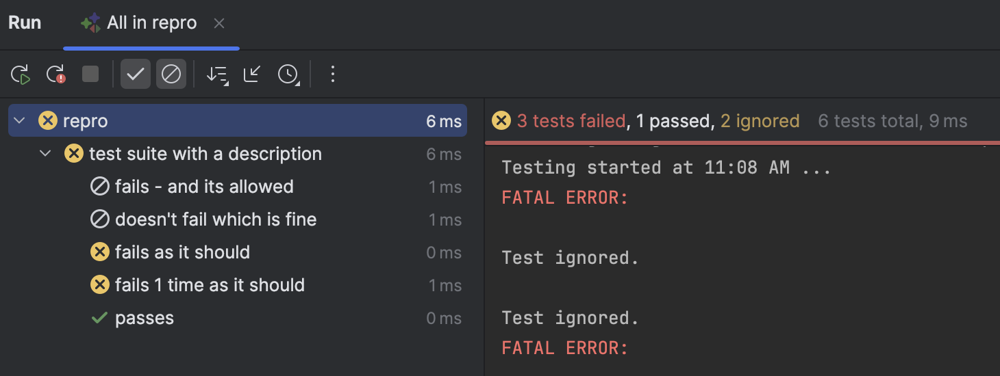

# clion-doctest-expectedfailure
Minimal repro... repo

## Issue
Tests using the `doctest::expected_failures` and `doctest::should_fail` decorators that succeed are shown as failures in the IDE's UI. They should be reported as passing, otherwise the UI effectively becomes unusable since every run will report spurious failures. The information does appear to be available from Doctest e.g. `<OverallResultsAsserts successes="0" failures="1" test_case_success="true" expected_failures="1"/>`, `<OverallResultsAsserts successes="0" failures="1" test_case_success="true"/>`

## Bonus issues
While you're at it, it would be very much appreciated to have the plugin pass fully qualified command line options (e.g. `--dt-reporters` instead of `-r`, which conflicts with other command line parsing we do). [CPP-22911](https://youtrack.jetbrains.com/projects/CPP/issues/CPP-22911/doctest-runner-should-use-prefixed-command-line-options) (5 years old) :)

The incorrect number of failures being reported is also a minor nit. [CPP-25198](https://youtrack.jetbrains.com/projects/CPP/issues/CPP-25198/Doctest-reports-incorrect-number-of-tests) (4 yrs old) :)


## Details

CLion: 2025.2.5

Doctest: https://github.com/doctest/doctest/blob/1da23a3e8119ec5cce4f9388e91b065e20bf06f5/doctest/doctest.h

OS: MacOS 15.7.1 (24G231)



Console output
```
[doctest] doctest version is "2.4.12"
[doctest] run with "--help" for options
===============================================================================
clion-doctest-expectedfailure/repro/main.cpp:8:
DESCRIPTION: regarding failures
TEST SUITE: test suite with a description
TEST CASE:  fails - and its allowed

clion-doctest-expectedfailure/repro/main.cpp:8: FATAL ERROR: 

Allowed to fail so marking it as not failed
===============================================================================
clion-doctest-expectedfailure/repro/main.cpp:11:
DESCRIPTION: regarding failures
TEST SUITE: test suite with a description
TEST CASE:  fails as it should

clion-doctest-expectedfailure/repro/main.cpp:11: FATAL ERROR: 

Failed as expected so marking it as not failed
===============================================================================
clion-doctest-expectedfailure/repro/main.cpp:13:
DESCRIPTION: regarding failures
TEST SUITE: test suite with a description
TEST CASE:  fails 1 time as it should

clion-doctest-expectedfailure/repro/main.cpp:13: FATAL ERROR: 

Failed exactly 1 times as expected so marking it as not failed!
===============================================================================
[doctest] test cases: 5 | 5 passed | 0 failed | 0 skipped
[doctest] assertions: 3 | 0 passed | 3 failed |
[doctest] Status: SUCCESS!

Process finished with exit code 0
```

XML reporter
```
repro % ./cmake-build-debug/repro --dt-reporters=xml
<?xml version="1.0" encoding="UTF-8"?>
<doctest binary="./cmake-build-debug/repro" version="2.4.12">
  <Options order_by="file" rand_seed="0" first="0" last="4294967295" abort_after="0" subcase_filter_levels="2147483647" case_sensitive="false" no_throw="false" no_skip="false"/>
  <TestSuite name="test suite with a description">
    <TestCase name="fails - and its allowed" filename="clion-doctest-expectedfailure/repro/main.cpp" line="8" description="regarding failures" may_fail="true">
      <Message type="FATAL ERROR" filename="clion-doctest-expectedfailure/repro/main.cpp" line="8">
        <Text/>
      </Message>
      <OverallResultsAsserts successes="0" failures="1" test_case_success="true"/>
    </TestCase>
    <TestCase name="doesn't fail which is fine" filename="clion-doctest-expectedfailure/repro/main.cpp" line="9" description="regarding failures" may_fail="true">
      <OverallResultsAsserts successes="0" failures="0" test_case_success="true"/>
    </TestCase>
    <TestCase name="fails as it should" filename="clion-doctest-expectedfailure/repro/main.cpp" line="11" description="regarding failures" should_fail="true">
      <Message type="FATAL ERROR" filename="clion-doctest-expectedfailure/repro/main.cpp" line="11">
        <Text/>
      </Message>
      <OverallResultsAsserts successes="0" failures="1" test_case_success="true"/>
    </TestCase>
    <TestCase name="fails 1 time as it should" filename="clion-doctest-expectedfailure/repro/main.cpp" line="13" description="regarding failures">
      <Message type="FATAL ERROR" filename="clion-doctest-expectedfailure/repro/main.cpp" line="13">
        <Text/>
      </Message>
      <OverallResultsAsserts successes="0" failures="1" test_case_success="true" expected_failures="1"/>
    </TestCase>
    <TestCase name="passes" filename="clion-doctest-expectedfailure/repro/main.cpp" line="15" description="regarding failures">
      <OverallResultsAsserts successes="0" failures="0" test_case_success="true"/>
    </TestCase>
  </TestSuite>
  <OverallResultsAsserts successes="0" failures="3"/>
  <OverallResultsTestCases successes="5" failures="0" skipped="0"/>
</doctest>
```